[![LinkedIn][linkedin-shield]][linkedin-url]

  <h3 align="center">IOT EBB & Flow system in Hydroponic technics with ESP32 Cam, Flutter and Firebase</h3>
  

   IOT project in EBB & Flow System in Hydroponic Technic which is the IOT fullstack project in that i implement three main aspect of IOT project include hardware implement - ESP32 Cam, software implement - Flutter App and server implement - Firebase Realtime database  

## Demo 

i just using the esp32 for demo, in this after state timer have the same time of pump water scheduler the system will change state and put anything in firebase, the app will get this infor and show it.
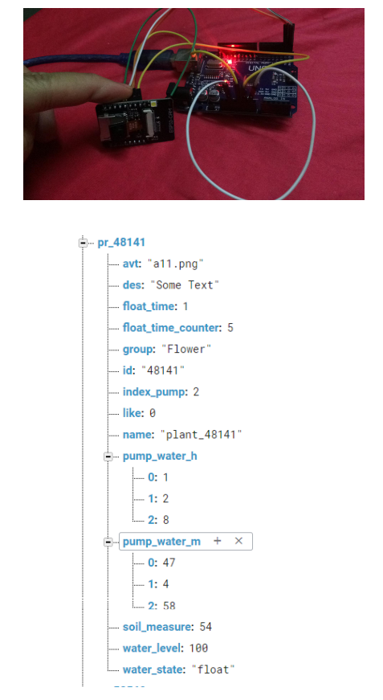
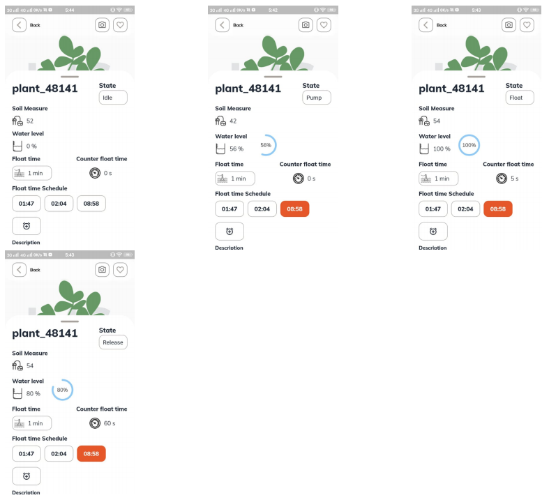

  
<h2 style="display: inline-block">Table of Contents</h2>

  <ol>
    <li><a href="#about-the-project">About The Project</a></li>
	<li><a href="#design">Design</a></li>
	<li><a href="#model-bucket">Model Bucket</a></li>
	<li><a href="#project-material">Block Diagram</a></li>
	<li><a href="#hardware-implement">Hardware Implement</a></li>
	<li><a href="#software-implement">Software Implement</a></li>
	<li><a href="#server-implement">Server Implement</a></li>
	<li><a href="#contact">Contact</a></li>
  </ol>

## About The Project

Ebb and Flow, also known as Flood and Drain, is one of the most widely recognized hydroponics systems out there. It is intermediate level in difficulty, relatively low-cost to set up, and extremely versatile. This method allows you to easily alter your garden, adding or removing plants as you wish without affecting any of the surrounding crops. Like other methods, the basic concept is very simple–plants are placed in a tray, which is periodically filled with nutrient-rich water pumped out of a reservoir below. The system uses gravity to return the water to the reservoir to be reused. This system seems complex to beginners because it involves so many different components, but they all come together quite easily and can be assembled in very little time. Once assembled, this system needs little maintenance and produces plants efficiently with very little electricity or water use. So I decide to make the IOT project for EBB and Flow system in Hydroponic technics in app using IOT server

## Design

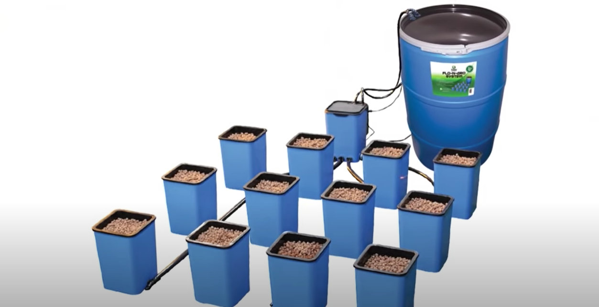

in spite of a Flo n' Gro 12 pot modular flood and drain hydroponics system, i makeing the design for this project system, in this i using the 12 bucket with 2 layer, 1 suplied bucket for pump water machine and 1 large bin for fertilizer solution, that can easy using for increase of scale project which we just buy the new one bucket with some sensor in that (the model in the subsection bellow).

After that i using Firebase supported by Google to be the server of this project FireBase is a free database from google, that easy to useeasy to apply for any kind of application especially Flutter.Just under 10 coding line to using Firebase. From that the system will send data to database in Firebase and keep that in server.

After that i using the Flutter to make the app for async Firebase to app, with this app i can control all information form bucket (change or see the sensor)

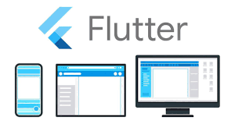

## Model Bucket

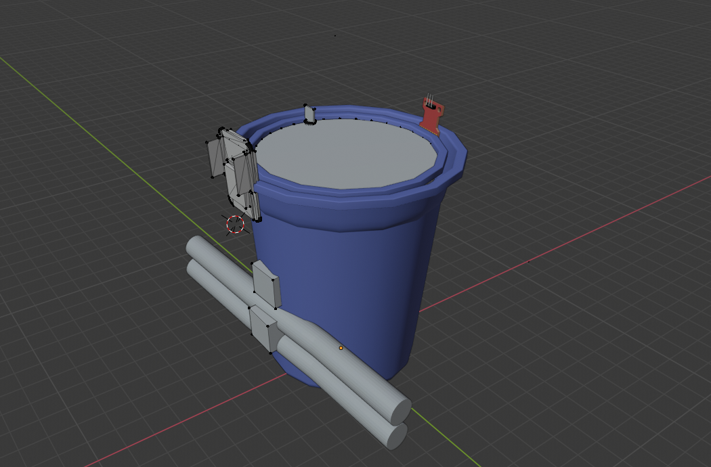
In this model, i using some device include: 2 bucket (with 1 bucket have some hole for transfer water to other bucket to them - bucket net pots), 2 pump water (one for pump water in other for out), 3 devices (ESP32, liquid sensor, soil measure sensor).

## Project Material

In this project, material of this project is devices above:
* Bucket net pots
* Bucket
* Water pump
* ESP32 cam
* Liquid Level Sensor
* Soil Moisture Sensor

## Block Diagram

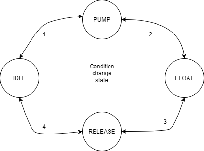

there are 4 state of this FSM: IDLE, PUMP, FLOAT and RELEASE
* IDLE: in this state the system stay to get interrupt from the internal real timer, if the array of pump time in system have the same time from timer, the system will change state to PUMP
state
* PUMP: in this state the system will turn on the pump water in to make water in this bucket while the system will read the real number of liquid level sensor. After water level in 98% the
system will change state to FLOAT state and turn off the pump water in.
* FLOAT: in this state the water will float the system will stay and just increase the float counter every second if that counter equal the system float time, this system will change state RELEASE.
* RELEASE: in this state this system will turn on the pump water out for release water out this bucket, using the liquid sensor for change state if this sensor return 0 the state will back to IDLE and turn off the pump water out, and back to the next period. In addition, this system will change the state when take the time out controller from server, after change state manually all number will should not change like when state in PUMP not need for liquid level sensor to be 100% we can change this state to other state like FLOAT or RELEASE without any condition of water level sensor.

## Hardware Implement

In this project, Hardware implement, from the  Block Diagram,  FSM will be create in the main board with code in Arduino language (ESP32 Cam). In this implement after any changing state this system just update same value like (water_state, soil_measure, water_level, float_time_counter, and idx) to node in Firebase server.

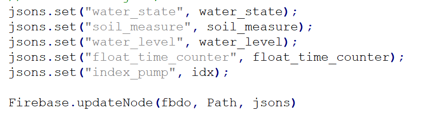

Code for this section in direction folder **"esp32project2.ino"** that from C language in Arduino IDE

## Software Implement

In this project i create the app PlantHydro using flutter and dart to main system.
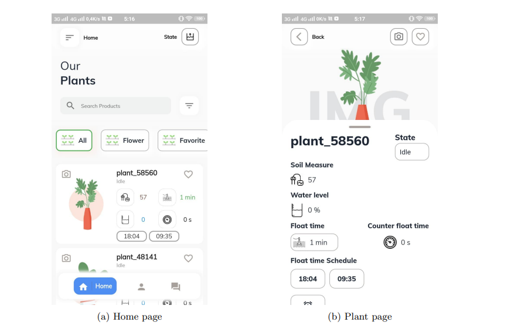
there two main page of this app. The home page and plant page. in home page user can see all plant of them in this page with some and enough information of plant(name, state, like, avt, soil measure, float time, float time counter, and water level) all infor will collect from Firebse. in Plant page we can see full information and can change some infor like state, float time and float time scheduler. After change all information will be update to firebase recently.
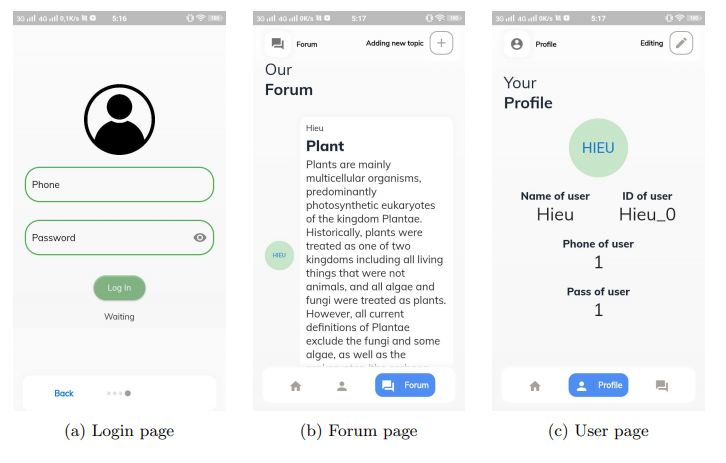
there three page of this app. Login page and forum page and user. just take data from Firebase database to show some addition information, with login page we should to login to join the app (home page), with forum we can add some new topic for more addition use, with user page we can change some important information from login user.

Code for this section in direction **"PlantHydro"** that from Dart language in Flutter

## Server Implement

In this implement, i using firebase for server of this project, i divide data for project like that:
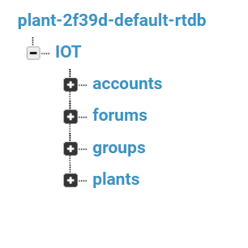
accounts, forums, groups data just for the UI server of App present in new section, we will focus into plants data. Account data content the id, name and pass of each customer, forums just contain the topic data (name of topic, topic content and name of user), groups just for group of plants (control from app)
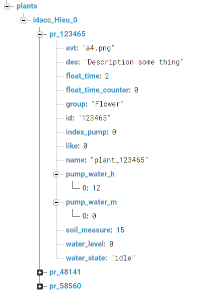

## Contact

Hieu Nguyen - [Linkedin](https://www.linkedin.com/in/hieunguyen-dev/)

Linkedin: https://www.linkedin.com/in/hieunguyen-dev/

Email: hnhieu979@gmail.com

Phone: 0927931496

Facebook: https://www.facebook.com/hieu.nguyenmixed

Project Link: [https://github.com/HieuNguyenHuu/IOT_EBBandFlowSystem_Flutter](https://github.com/HieuNguyenHuu/IOT_EBBandFlowSystem_Flutter)

[linkedin-shield]: https://img.shields.io/badge/-LinkedIn-black.svg?style=for-the-badge&logo=linkedin&colorB=555
[linkedin-url]: https://www.linkedin.com/in/hieunguyen-dev/

